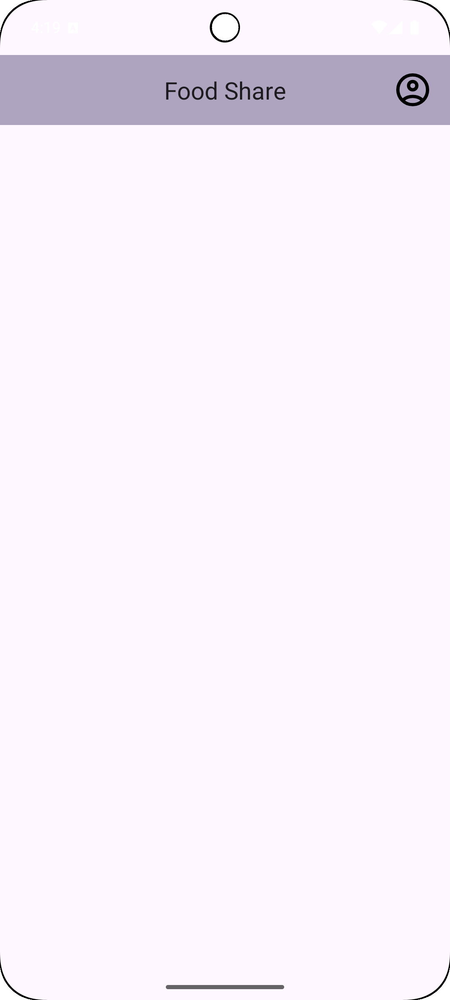
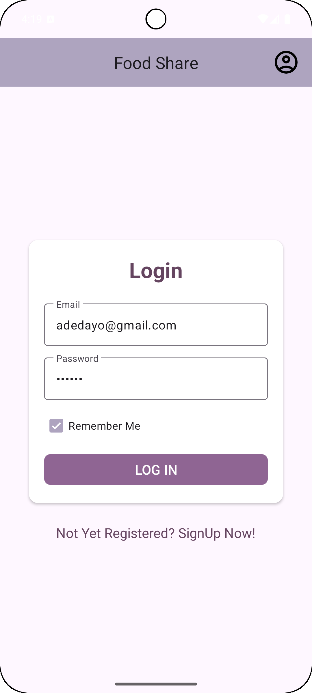
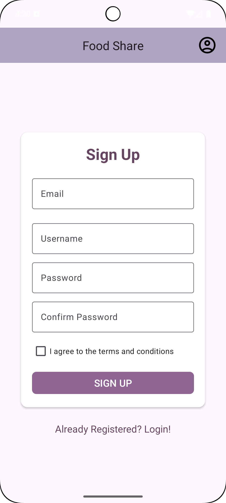
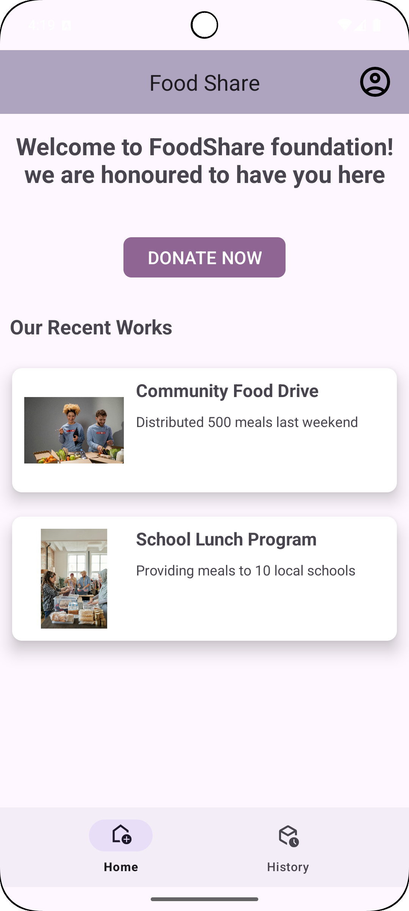
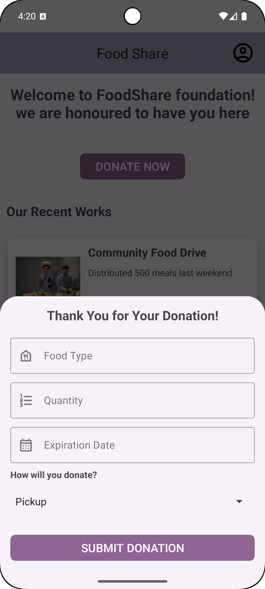
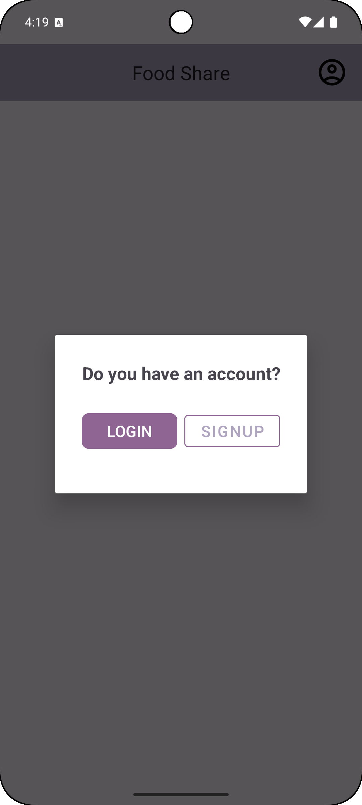
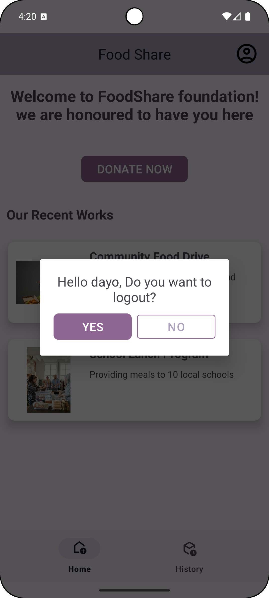

# Food Donation App (Android + Room Database)

This Android application allows users to donate food, track donations, and manage items locally using **Room Database**. It is built with **Kotlin**, **DAO interfaces**, and the **MVVM architecture**, ensuring clean data flow and offline-first functionality.

---

## 🍲 Features

- Add new food donation items
- Edit and delete existing items
- Persist data locally using Room
- DAO-based CRUD operations
- MVVM architecture with ViewModel + LiveData
- Simple, clean XML UI
- RecyclerView for listing donations

---

## 🛠️ Tech Stack

| Component | Technology |
|----------|------------|
| Language | Kotlin |
| Local Storage | Room Database |
| Data Access | DAO Interfaces |
| Architecture | MVVM |
| UI | XML Layouts |
| Reactive Updates | LiveData / ViewModel |

---

## 📂 Project Structure

Then reference them like this:

  

---
## 📱 App Screenshots

### Onboarding & Authentication

<table>
  <tr>
    <td></td>
    <td></td>
    <td></td>
    <td></td>
  </tr>
</table>

### Dashboard & Donating

<table>
  <tr>
    <td></td>
    <td></td>
    <td></td>
  </tr>
</table>

## Donation History

<table>
  <tr>
    <td></td>
  </tr>
</table>

## 👤 Developer

**Emmanuel Oyenuga**  
Mobile App Developer – Winnipeg, MB  

